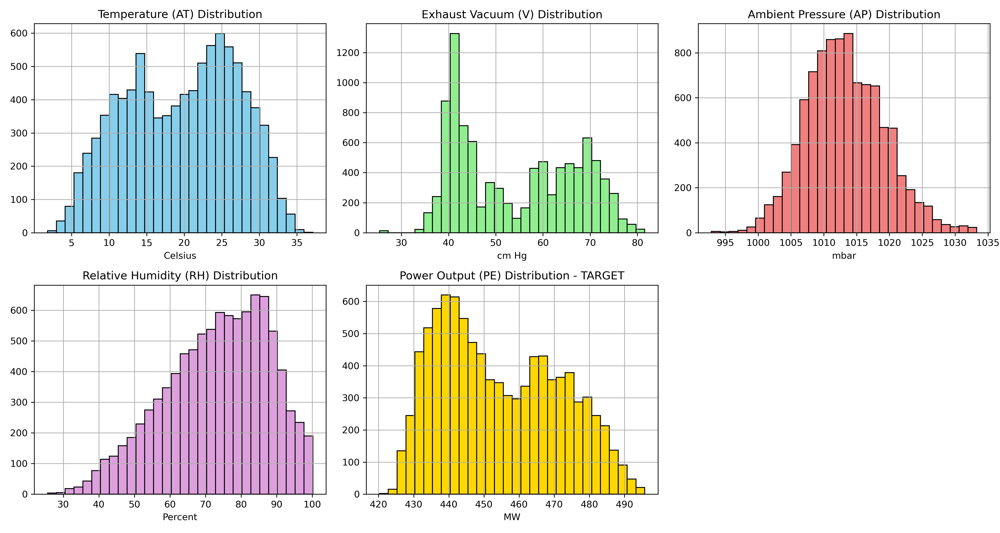
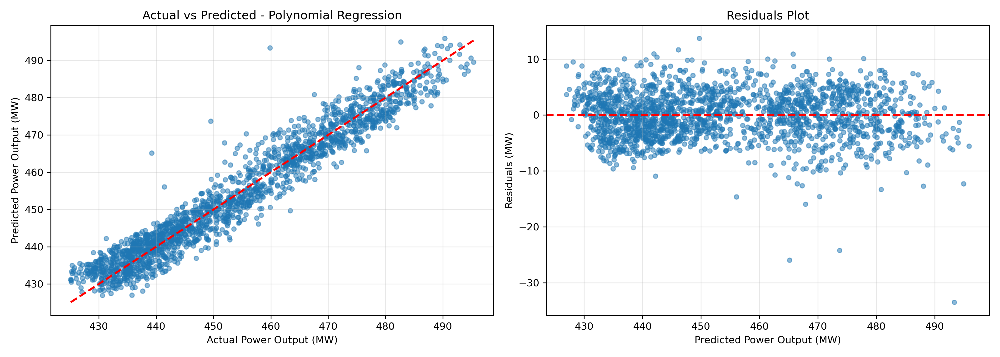

# 🔋 Linear Regression Analysis: Combined Cycle Power Plant Energy Output Prediction

[](https://www.python.org/)
[](https://jupyter.org/)
[](LICENSE)
[](https://scikit-learn.org/)

## 📋 Project Overview

This project applies **Linear Regression** and advanced regression techniques to predict the **electrical energy output** of a Combined Cycle Power Plant (CCPP). Using environmental factors such as temperature, pressure, humidity, and exhaust vacuum, the models achieve exceptional predictive accuracy with an **R² score of 0.93** and remarkably low error metrics.

### 🎯 Key Highlights

- **High Accuracy**: R² score of 0.938 with Polynomial & Ridge Regression
- **Low Error Rates**: RMSE of 4.23 MW and MAE of 3.35 MW
- **Multiple Models**: Comparison of Linear, Polynomial, and Ridge Regression
- **Comprehensive Analysis**: EDA, feature engineering, and model evaluation
- **Production-Ready**: Clean code structure with outputs and visualizations

---

## 📊 Dataset Information

**Source**: [UCI Machine Learning Repository - Combined Cycle Power Plant Dataset](https://archive.ics.uci.edu/ml/datasets/Combined+Cycle+Power+Plant)

**Description**: The dataset contains 9,568 data points collected from a Combined Cycle Power Plant over 6 years (2006-2011).

### Features:

| Feature | Description | Unit | Range |
|---------|-------------|------|-------|
| **AT** | Ambient Temperature | °C | 1.81 - 37.11 |
| **V** | Exhaust Vacuum | cm Hg | 25.36 - 81.56 |
| **AP** | Ambient Pressure | millibar | 992.89 - 1033.30 |
| **RH** | Relative Humidity | % | 25.56 - 100.16 |
| **PE** | Net Hourly Electrical Energy Output (Target) | MW | 420.26 - 495.76 |

**Dataset Size**: 9,568 observations × 5 features

---

## 🏗️ Project Structure

```
Linear-Regression-Analysis-CCPP-Energy-Output-Prediction/
│
├── data/
│   ├── CCPP_data.csv              # Processed dataset
│   └── Folds5x2_pp.xlsx           # Original dataset
│
├── notebooks/
│   └── 01_linear_regression_ccpp.ipynb  # Main analysis notebook
│
├── outputs/
│   ├── visualizations/
│   │   ├── actual_vs_predicted.png      # Model predictions plot
│   │   ├── distributions.png            # Feature distributions
│   │   └── scatter_plots.png            # Correlation analysis
│   ├── model_coefficients.csv           # Model coefficients
│   └── performance_metrics.csv          # Performance metrics
│
├── Report/                        # Project documentation
├── .gitignore                     # Git ignore file
└── README.md                      # Project documentation
```

---

## 🔍 Exploratory Data Analysis

### Feature Distributions



*Distribution analysis of all features showing the spread and central tendencies of environmental variables and energy output.*

### Correlation Analysis


*Scatter plots revealing strong correlations between environmental factors and energy output. Notable negative correlation with Ambient Temperature (AT) and Exhaust Vacuum (V).*

---

## 🤖 Models & Results

### Performance Comparison

| Model | Train R² | Test R² | RMSE (MW) | MAE (MW) |
|-------|----------|---------|-----------|----------|
| **Linear Regression** | 0.9283 | 0.9301 | 4.50 | 3.60 |
| **Polynomial (Degree 2)** | 0.9377 | **0.9383** | **4.23** | **3.35** |
| **Ridge Regression** | 0.9377 | **0.9382** | **4.23** | **3.35** |

### 🏆 Best Model: Polynomial Regression (Degree 2) & Ridge Regression

- **R² Score**: 0.9383 (93.83% variance explained)
- **RMSE**: 4.23 MW (excellent accuracy)
- **MAE**: 3.35 MW (average prediction error)
- **Model Stability**: Minimal overfitting with consistent train/test performance

### Prediction Visualization



*Comparison of actual vs predicted energy output showing excellent model fit with most predictions falling close to the ideal diagonal line.*

---

## 🔧 Technologies Used

- **Python 3.8+**
- **Libraries**:
  - `pandas` - Data manipulation and analysis
  - `numpy` - Numerical computing
  - `scikit-learn` - Machine learning models and metrics
  - `matplotlib` - Data visualization
  - `seaborn` - Statistical visualization
  - `jupyter` - Interactive notebook environment

---

## 🚀 Getting Started

### Prerequisites

```bash
python >= 3.8
jupyter notebook or jupyter lab
```

### Installation

1. **Clone the repository**

```bash
git clone https://github.com/adarsh6980/Linear-Regression-Analysis-CCPP-Energy-Output-Prediction.git
cd Linear-Regression-Analysis-CCPP-Energy-Output-Prediction
```

2. **Create a virtual environment** (optional but recommended)

```bash
python -m venv venv
source venv/bin/activate  # On Windows: venv\Scripts\activate
```

3. **Install required packages**

```bash
pip install pandas numpy scikit-learn matplotlib seaborn jupyter
```

### Running the Analysis

1. **Launch Jupyter Notebook**

```bash
jupyter notebook
```

2. **Open the notebook**

Navigate to `notebooks/01_linear_regression_ccpp.ipynb` and run all cells.

3. **View Results**

Check the `outputs/` directory for:
- Visualizations in `outputs/visualizations/`
- Model metrics in `outputs/performance_metrics.csv`
- Model coefficients in `outputs/model_coefficients.csv`

---

## 📈 Key Findings

### 1. **Strong Predictive Features**
   - **Ambient Temperature (AT)**: Strongest negative correlation with energy output
   - **Exhaust Vacuum (V)**: Significant negative impact on output
   - **Ambient Pressure (AP)** and **Relative Humidity (RH)**: Moderate positive effects

### 2. **Model Performance**
   - Linear Regression provides excellent baseline performance (R² = 0.93)
   - Polynomial features improve accuracy by capturing non-linear relationships
   - Ridge Regression prevents overfitting while maintaining high accuracy

### 3. **Practical Implications**
   - Models can predict energy output within ±3.35 MW accuracy
   - Enables efficient power plant operation and maintenance planning
   - Helps optimize energy production based on environmental conditions

---

## 💡 Methodology

1. **Data Preprocessing**
   - Data cleaning and validation
   - Feature scaling using StandardScaler
   - Train-test split (80-20)

2. **Exploratory Data Analysis**
   - Statistical summary and distribution analysis
   - Correlation matrix and heatmap visualization
   - Outlier detection and treatment

3. **Model Development**
   - Linear Regression (baseline)
   - Polynomial Regression (degree 2)
   - Ridge Regression (regularization)

4. **Model Evaluation**
   - R² Score (coefficient of determination)
   - RMSE (Root Mean Square Error)
   - MAE (Mean Absolute Error)
   - Residual analysis

---

## 🎓 Learning Outcomes

This project demonstrates:

✅ **Data Analysis**: Comprehensive EDA techniques and visualization strategies

✅ **Regression Modeling**: Implementation of multiple regression algorithms

✅ **Feature Engineering**: Polynomial feature transformation and scaling

✅ **Model Evaluation**: Rigorous comparison using multiple metrics

✅ **Regularization**: Application of Ridge Regression to prevent overfitting

✅ **Best Practices**: Clean code structure, documentation, and reproducibility

---

## 📚 References

1. [UCI Machine Learning Repository - CCPP Dataset](https://archive.ics.uci.edu/ml/datasets/Combined+Cycle+Power+Plant)
2. [Scikit-learn Documentation](https://scikit-learn.org/stable/documentation.html)
3. Tüfekci, P. (2014). Prediction of full load electrical power output of a base load operated combined cycle power plant using machine learning methods. *International Journal of Electrical Power & Energy Systems*, 60, 126-140.

---

## 🤝 Contributing

Contributions, issues, and feature requests are welcome! Feel free to check the [issues page](https://github.com/adarsh6980/Linear-Regression-Analysis-CCPP-Energy-Output-Prediction/issues).

### How to Contribute

1. Fork the repository
2. Create your feature branch (`git checkout -b feature/AmazingFeature`)
3. Commit your changes (`git commit -m 'Add some AmazingFeature'`)
4. Push to the branch (`git push origin feature/AmazingFeature`)
5. Open a Pull Request

---

## 📧 Contact

**Adarsh Ramakrishna**

- GitHub: [@adarsh6980](https://github.com/adarsh6980)
- Email: adireland.ie@gmail.com
- LinkedIn: [Connect with me](https://www.linkedin.com/in/adarsh-ramakrishna-sd/)

---

## 📄 License

This project is open source and available under the [MIT License](LICENSE).

---

## ⭐ Show Your Support

Give a ⭐️ if this project helped you!

---

## 🔮 Future Enhancements

- [ ] Implement advanced models (XGBoost, Random Forest, Neural Networks)
- [ ] Add time series analysis for temporal patterns
- [ ] Deploy model as a REST API using Flask/FastAPI
- [ ] Create interactive dashboard with Streamlit/Dash
- [ ] Add hyperparameter tuning with Grid/Random Search
- [ ] Implement cross-validation for robust evaluation
- [ ] Add feature importance analysis
- [ ] Include confidence intervals for predictions

---

<div align="center">

**Made with ❤️ for Data Science & Machine Learning**

[⬆ Back to Top](#-linear-regression-analysis-combined-cycle-power-plant-energy-output-prediction)

</div>
